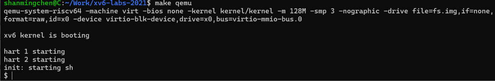

# Lab 0 操作系统实验环境配置

## 实验目的

本实验在 Windows Subsystem for Linux 2（WSL2）中搭建 RISC-V 操作系统开发环境，并通过编译、启动 MIT 6.S081 2021 课程的 xv6 验证工具链是否可用。

xv6 只用于验证环境，不是本项目后续自研操作系统的代码基础。后续内核将在独立目录和独立 Git 仓库中从零实现。

## 实验环境

| 项目 | 配置 |
| --- | --- |
| 宿主系统 | Windows + WSL2 |
| Linux 发行版 | Ubuntu 24.04.4 LTS |
| Linux 内核 | 6.6.87.2-microsoft-standard-WSL2 |
| 目标架构 | RISC-V 64 位 |
| RISC-V GCC | 10.5.0 |
| GNU Binutils | 2.42 |
| QEMU | 8.2.2 |
| GDB | 15.1（支持 `riscv:rv64`） |
| Git | 2.43.0 |

WSL2 提供独立的 Linux 文件系统、Linux 内核环境和虚拟化能力，可以完成文档中 Ubuntu 虚拟机承担的编译、调试和 QEMU 仿真任务。

## 安装开发工具

在 Ubuntu WSL 终端中更新软件包索引：

```bash
sudo apt update
```

安装课程所需的编译器、调试器、QEMU 和常用开发工具：

```bash
sudo apt install -y \
  git \
  build-essential \
  gdb-multiarch \
  qemu-system-misc \
  gcc-riscv64-linux-gnu \
  binutils-riscv64-linux-gnu \
  pkg-config \
  libglib2.0-dev \
  libpixman-1-dev
```

检查主要工具是否安装成功：

```bash
riscv64-linux-gnu-gcc --version
riscv64-linux-gnu-ld --version
qemu-system-riscv64 --version
gdb-multiarch --version
git --version
```

## GCC 版本兼容处理

Ubuntu 24.04 默认提供 GCC 13。该版本会对 xv6 2021 的 `user/sh.c` 报告 `-Winfinite-recursion`，而 xv6 使用了 `-Werror`，所以警告会使编译中止。

安装与课程年代更接近的 RISC-V GCC 10：

```bash
sudo apt install -y gcc-10-riscv64-linux-gnu
```

让 xv6 的默认构建命令优先使用 GCC 10：

```bash
sudo ln -sf \
  /usr/bin/riscv64-linux-gnu-gcc-10 \
  /usr/local/bin/riscv64-linux-gnu-gcc
```

再次确认版本：

```bash
riscv64-linux-gnu-gcc --version
```

输出中应显示 GCC 10.5.0。此方法不需要修改 xv6 源码。

## 下载 xv6 验证代码

创建实验目录并克隆 MIT 6.S081 2021 实验仓库：

```bash
mkdir -p ~/Work
cd ~/Work
git clone git://g.csail.mit.edu/xv6-labs-2021
cd xv6-labs-2021
```

切换到 Lab util 对应的 `util` 分支：

```bash
git checkout util
```

使用以下命令确认当前分支：

```bash
git branch --show-current
```

预期输出：

```text
util
```

## 编译并运行 xv6

切换实验分支后，先清理其他分支可能留下的构建产物，再启动 xv6：

```bash
make clean
make qemu
```

环境配置正确时，可以看到类似输出：

```text
xv6 kernel is booting

hart 1 starting
hart 2 starting
init: starting sh
$
```

实际运行结果如下：



退出 QEMU 时，先按 `Ctrl+A`，松开后再按 `X`。

## 验证结果

- RISC-V 交叉编译器可以生成 64 位 RISC-V 内核。
- GNU Binutils 可以完成链接、反汇编和目标文件处理。
- QEMU 可以加载并运行 xv6 内核。
- xv6 可以完成多核启动并进入 Shell。
- GDB 可以识别 `riscv:rv64` 目标架构。
- `util` 分支能够在不修改课程源码的情况下完成全量编译。

综上，当前 WSL2 环境已满足后续 RISC-V 操作系统学习、裸机内核开发和调试的基础要求。

## 常用命令

```bash
# 进入 xv6 验证目录
cd ~/Work/xv6-labs-2021

# 查看当前实验分支
git branch --show-current

# 清理并重新编译
make clean

# 编译并运行
make qemu

# 查看工作区状态
git status
```

## 参考资料

- [MIT 6.S081 Fall 2021](https://pdos.csail.mit.edu/6.828/2021/)
- [MIT 6.S081 2021 Tools](https://pdos.csail.mit.edu/6.828/2021/tools.html)
- [MIT 6.S081 2021 Lab util](https://pdos.csail.mit.edu/6.828/2021/labs/util.html)
